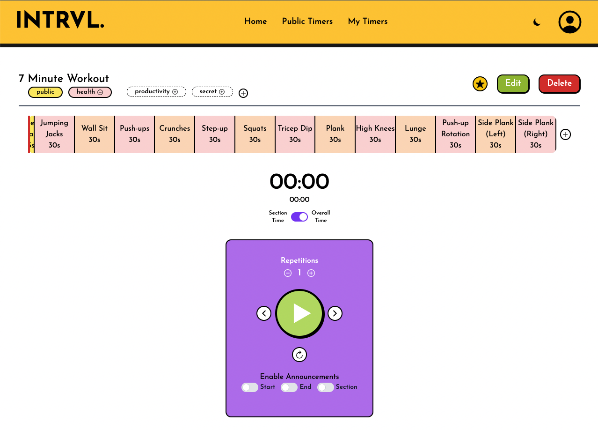
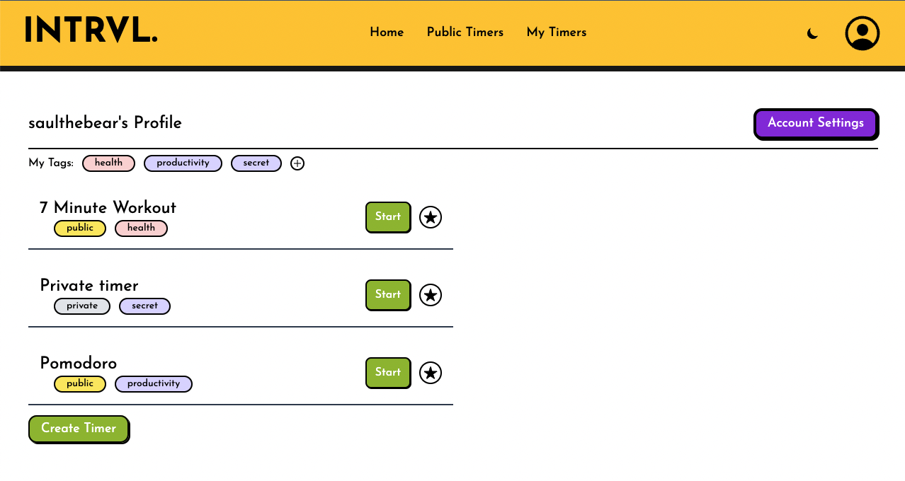
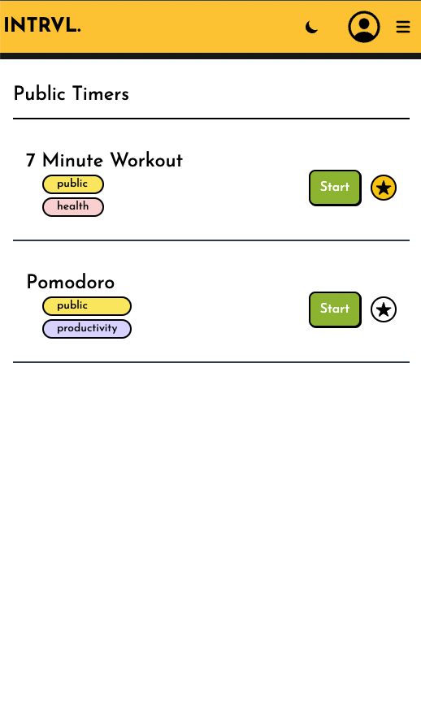
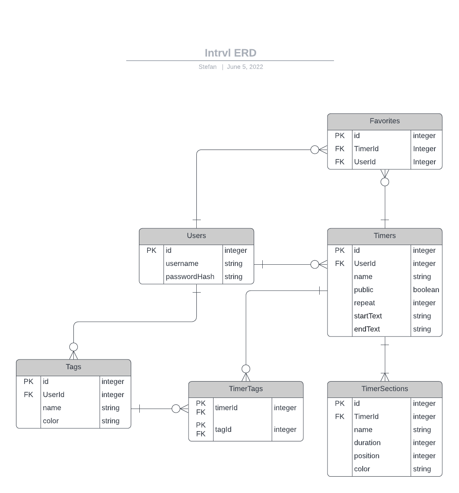

# INTRVL. ⏱

Intrvl is a web app that allows users to create custom interval timers.

Timers consist of named sections, and users can skip to the next / previous sections. Text-to-Speech is also used to give the user the option of having an announcement spoken when the timer starts and ends, as well as announcing the name of each section as it starts. Users can also choose to make a timer public, so that it can be used by others, and users can make lists of their favorite timers (their own or other users' public timers) so they can get to them quickly.

[⏱ Try it out!](https://intrvl.herokuapp.com/)

## Table of contents

- [🖼 Screenshots](#screenshots)
- [👀 Overview](#overview)
  - [🏔 The challenge](#the-challenge)
  - [🔗 Links](#links)
- [⚙️ Details](#details)
  - [🛠 Built with](#built-with)
  - [↔️ Entity Relationship Diagram (ERD)](#entity-relationship-diagram-erd)
  - [🗺 Routes](#routes)
  - [🧠 What I learned](#what-i-learned)
  - [🔎 Resources referenced](#resources-referenced)
- [🧑‍💻 Author](#author)

## Screenshots

- Timer Page
  - 
- Profile Page
  - 
- Public Timers Page - Mobile Layout
  - 

## Overview

### The challenge

#### Project requirements:

- A full-stack application
- Have complete restful routes for at least one model (GET, POST, PUT, DELETE)
- Utilize an ORM to create and interact with the database

#### Personal Goals:

- Minimum Viable Product (MVP)
  - [x] Allow users to sign up / login
  - [x] Allow users to create / edit / delete timers
  - [x] Allow users to view all their timers and use each
  - [x] Use a Text-to-Speech API to announce when a timer is starting and ending
- Stretch Goals:
  - [x] Allow timers to be repeated
  - [x] Allow timers to have 'sections'
    - [x] Allow sections to be rearranged
    - [ ] Allow sections to be repeated
  - [x] Allow users to add tags (categories) to timers
  - [x] Allow user to set some timers as public, and others as private
  - [x] Allow users to have timer section names be announced when that section starts
  - [x] Styling
    - [x] Use TailwindCSS
    - [x] Responsive design
    - [x] Dark mode
  - [ ] Allow users to duplicate an existing timer to use it as a template

### Links

- Live Site: [Intrvl.](https://intrvl.herokuapp.com/)
- Original Project Pitch and Wireframes: [Github README](./projectPitch/README.md)

## Details

### Built with

- **Backend:** NodeJS, PostgreSQL, Sequelize, EJS
- **Frontend:** TailwindCSS, Flowbite, JavaScript
- Web Speech API

---

- The timer functionality was built with JavaScript, and relies on a fixed time-step engine, built for my previous project [Bodhi's Dreamworld](https://github.com/saulthebear/bodhi-dreamworld).
- Text-to-Speech relies on the native web speech synthesis API: [SpeechSynthesis](https://developer.mozilla.org/en-US/docs/Web/API/SpeechSynthesis)
- The app interacts with the PostgreSQL database through the [Sequelize ORM](https://sequelize.org/)
- Views are built with the Embedded JavaScript (EJS) templating language, while styling was done with [TailwindCSS](https://tailwindcss.com/) (a utility-first CSS framework) and [Flowbite](https://flowbite.com/) (an open-source library of components built with TailwindCSS). [Ionicons](https://ionic.io/ionicons) (open-source icons library) was used to add SVG icons. [Typed.js](https://github.com/mattboldt/typed.js/) was used for a text animation on the home page
- [Winston](https://www.npmjs.com/package/winston) and [Chalk](https://www.npmjs.com/package/chalk) were used for logging. Winston allowed the creation of different logging outputs, depending on environment logging level. For example, errors are logged in a separate file, so they can be easily found, and in development all levels of logging are output to the console.
- [connect-flash](https://www.npmjs.com/package/connect-flash) was used to show flash messages to users upon redirect, to let them know if an action succeeded or to inform them why an action had failed.

### Entity Relationship Diagram (ERD)

### Routes

| HTTP Verb | URL Pattern                          | Action  | Description                                  |
| --------- | ------------------------------------ | ------- | -------------------------------------------- |
| GET       | /                                    | Index   | Describe app, show nav links                 |
| GET       | /login                               | New     | Show login form                              |
| POST      | /login                               | Create  | Log user in, by setting a cookie             |
| GET       | /logout                              | Destroy | Log user out, by deleting a cookie           |
| POST      | /favorites/:timerId                  | Create  | Add timer to favorites                       |
| DELETE    | /favorites/:timerId                  | Destroy | Remove timer from favorites                  |
| GET       | /users/new                           | New     | Show form to sign up                         |
| POST      | /users                               | Create  | Create a new user                            |
| GET       | /users/:id                           | Show    | Show user profile and their timers           |
| GET       | /users/:id/edit                      | Edit    | Show form to update user profile             |
| PUT       | /users/:id                           | Update  | Update profile / credentials                 |
| DELETE    | /users/:id                           | Destroy | Delete user's account                        |
| GET       | /users/:id/favorites                 | Index   | Show users favorites                         |
| GET       | /timers                              | Index   | Show all public timers                       |
| GET       | /timers/:id                          | Show    | Show a specific timer                        |
| GET       | /timers/new                          | New     | Show form to create a new timer              |
| POST      | /timers                              | Create  | Create a new timer                           |
| GET       | /timers/:id/edit                     | Edit    | Show form to edit a timer                    |
| PUT       | /timers/:id                          | Update  | Update a timer                               |
| DELETE    | /timers/:id                          | Destroy | Delete a timer                               |
| POST      | /timers/:timerId/sections            | Create  | Create a new timer section                   |
| PUT       | /timers/:timerId/sections/:sectionId | Update  | Update a section                             |
| DELETE    | /timers/:timerId/sections/:sectionId | Destroy | Delete a timer section                       |
| POST      | /timers/:timerId/tag/:tagId          | Create  | Associate a tag with a timer                 |
| DELETE    | /timers/:timerId/tag/:tagId          | Destroy | Remove association between a tag and a timer |
| GET       | /tags/new                            | New     | Show form to create a tag                    |
| POST      | /tags                                | Create  | Create a new tag                             |
| GET       | /tags/:id                            | Index   | Show all timers associated with a tag        |
| GET       | /tags/:id/edit                       | Edit    | Show form to edit a tag                      |
| PUT       | /tags/:id                            | Update  | Update a tag                                 |
| DELETE    | /tags/:id                            | Destroy | Delete a tag                                 |

### What I learned

- This project allowed me to strengthen my skills in planning and designing an Entity Relationship Diagram, and then implementing that design
- I also learned how to use the [SpeechSynthesis](https://developer.mozilla.org/en-US/docs/Web/API/SpeechSynthesis) API. I had originally planned to use an external TTS engine, such as the [Google Cloud Text-to-Speech API](https://cloud.google.com/text-to-speech), however the complexity of needing to generate the speech on the backend, store MP3 files, and then send those to the client, seemed unnecessary given the widespread browser support for speech synthesis. In the future, I plan to continue building on this project by allowing the user to select the type of voice they would like to use, as well as the pitch, tone, and speed.
- This project allowed me to continue practicing my skills in creating interactive elements in JavaScript and HTML. Building the timer component and allowing users to skip forward / backwards through timer sections was a fun challenge.
- I learned how to use throttling for better performance. In the view showing the timer, there is a function that fires on window resize events, to ensure the timer sections are displayed at the correct width; to ensure this function isn't called too many times as the user is resizing their window, throttling is used so that it runs at most every 500ms.
- I learned how to use [Chai](https://www.chaijs.com/) and [Mocha](https://mochajs.org/) for testing, along with [supertest](https://www.npmjs.com/package/supertest) and [FakerJs](https://fakerjs.dev/). I have tests for the user model, for example, which ensure the methods for hashing and verifying passwords are working correctly. I had originally planned on using a Test Driven Development approach for this project, however, considering that this is a monolithic full-stack application and the routes directly send HTML to the client (rather than JSON), the complexity of learning to test views (essentially performing integration testing, rather than unit testing) in the tight time frame of this project was too much. In the end, I only wrote tests for a few models.
- On the design front, I learned about [Neubrutalism](https://hype4.academy/articles/design/neubrutalism-is-taking-over-web) and tried to use this style for the app.

### Resources referenced

- [Learn Debounce And Throttle In 16 Minutes](https://www.youtube.com/watch?v=cjIswDCKgu0)
- [Flash Messages in NodeJS](https://www.bacancytechnology.com/blog/flash-messages-in-nodejs)
- [SVGOMG - SVG Optimizer](https://jakearchibald.github.io/svgomg/)
- [Regular expression to identify a BCrypt hash](https://stackoverflow.com/questions/31417387/regular-expression-to-find-bcrypt-hash)
- [Cheatsheet: Write Good Tests with Mocha](https://www.codecademy.com/learn/fscp-test-driven-development-with-javascript/modules/fecp-write-good-tests-with-mocha/cheatsheet)
- [Testing with Sequelize](https://medium.com/riipen-engineering/testing-with-sequelize-cc51dafdfcf4)
- [ExpressJS and Sequelize application tested with mocha, chai, supertest, migrations and seeds](https://medium.com/nowports-tech/expressjs-and-sequelize-application-tested-with-mocha-chai-supertest-migrations-and-seeds-d306a8ee4add)
- [Neubrutalism is taking over the web (Article)](https://hype4.academy/articles/design/neubrutalism-is-taking-over-web)
- [Neubrutalism is taking over Web Design (Video)](https://www.youtube.com/watch?v=yImWkiVB5fs)

## Author

- Linkedin - [Stefan Vosloo](https://www.linkedin.com/in/stefan-vosloo/)
- Twitter - [@saulthebear](https://www.twitter.com/saulthebear)
