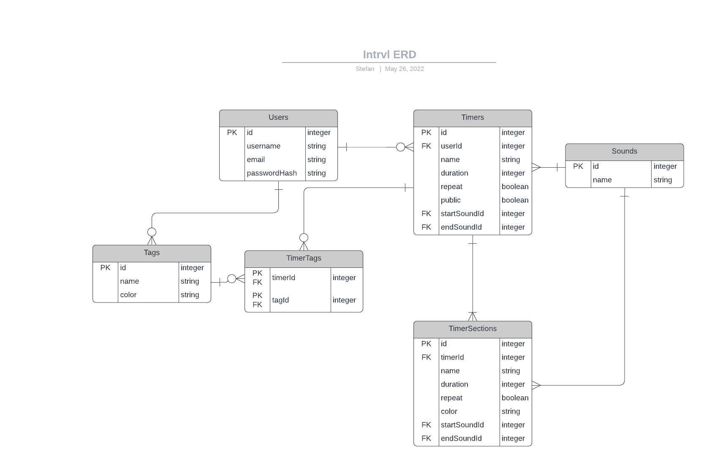
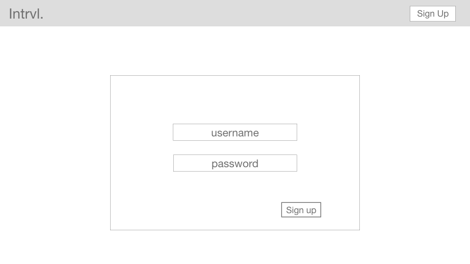
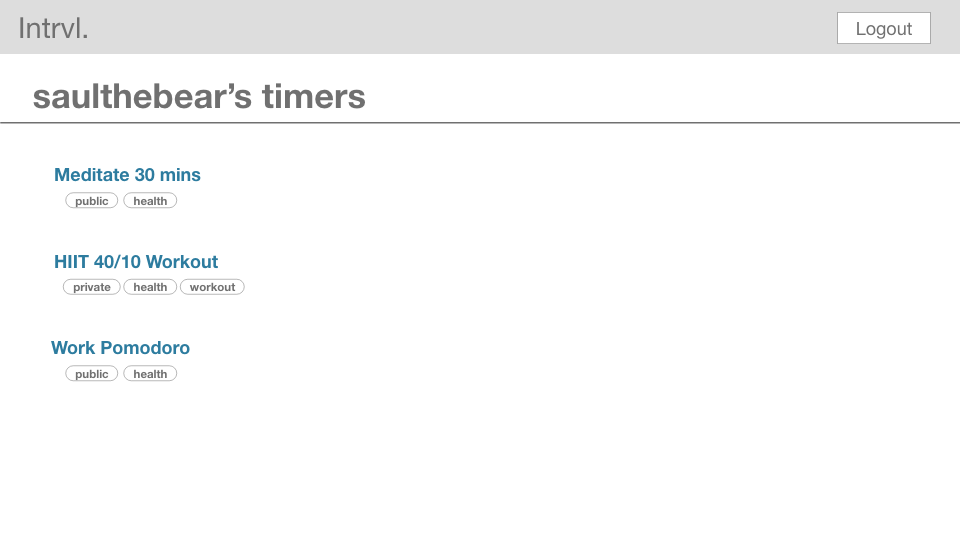
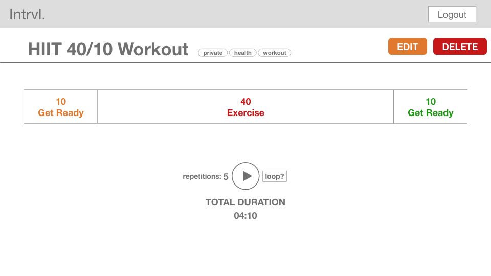

# Intrvl - Custom Interval Timers

Intrvl allows you to easily create custom interval timers. Use these to time workouts, meditation sessions, or test administration. You can create repeating timer sections within the overall timer, add sounds or text-to-speech notifications when the next interval starts, and much more!

## Tech stack

- Node, ExpressJS
- TailwindCSS
- Google Cloud Text-to-Speech API
  - Tested ✅

## User Stories

- As a user I want to be able to create and use a timer.
- As a user I want to be able to edit or delete a saved timer.
- As a user I want to be able to see all my timers, so that I can look for and navigate to a specific one.
- As a user I want my timers to be private by default.
- As a user I want to be able to make specific timers public, so that other users can use them.
- As a user I want to be able to hear when a timer or timer section starts and ends, so that I don't have to be looking at the screen.
- As a user, I want to be able to duplicate a timer, so that I don't have to start from scratch.
- As a user, I want to be able to share a link to specific public timer.
- As a user I want to be able to delete my account.
- As a user I want to be able to update my password.
- As a guest user I want to be able to view and use public timers.
- As a guest user I want to be able to create and use a one-off timer.

## ERD

## RESTful Routes

There are no routes for tags (categories), timer sections, or sounds, since these will be integrated in other views (eg. showing the user's tags on their profile page, and showing a timer's sections on that timer's page)

| HTTP Verb | URL Pattern       | Action  | Description                                                      |
| --------- | ----------------- | ------- | ---------------------------------------------------------------- |
| GET       | /                 | Index   | Describe app, show nav links                                     |
| GET       | /users/new        | New     | Show form to sign up                                             |
| POST      | /users            | Create  | Log user in                                                      |
| GET       | /users/:id        | Show    | Show user profile                                                |
| PUT       | /users/:id        | Update  | Update profile / credentials                                     |
| DELETE    | /users/:id        | Destroy | Delete user's account                                            |
| GET       | /users/:id/edit   | Edit    | Show form to update user profile                                 |
| GET       | /users/:id/timers | Index   | Show a user's public timers (or all timers if user is logged in) |
| GET       | /timers/:id       | Show    | Show a specific timer                                            |
| GET       | /timers/new       | New     | Show form to create a new timer                                  |
| POST      | /timers           | Create  | Create a new timer                                               |
| GET       | /timers/:id/edit  | Edit    | Show form to edit a timer                                        |
| PUT       | /timers/:id       | Update  | Update a timer                                                   |
| DELETE    | /timers/:id       | Destroy | Delete a timer                                                   |

## Wireframes

## MVP Goals

- Allow users to sign up / login
- Allow users to create / edit / delete timers
- Allow user to access all their timers and use them
- Use TTS API to announce when a timer is starting and ending

## Stretch Goals

- Allow timers to have 'sections' that can be repeated
- Allow sections to be rearranged and edited
- Allow user to duplicate an existing timer to use as a template
- Allow user to set some timers as public, and others as private
- Allow user to set custom messages or sounds to be played when a timer section starts / ends
- Style with TailwindCSS
